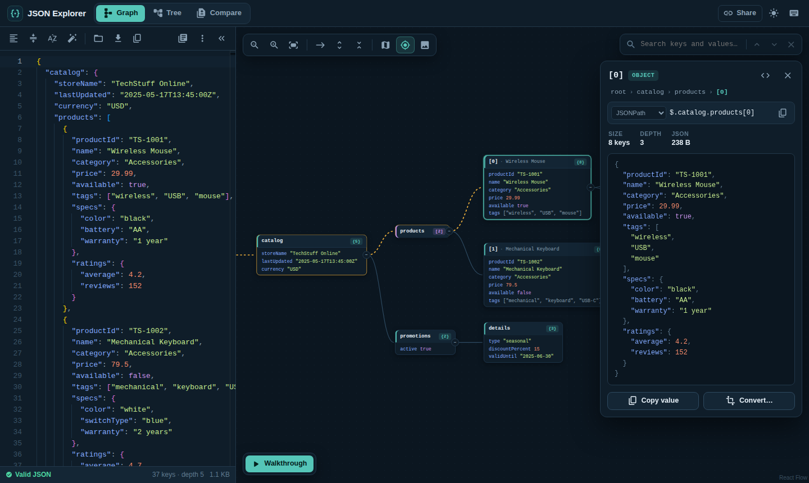
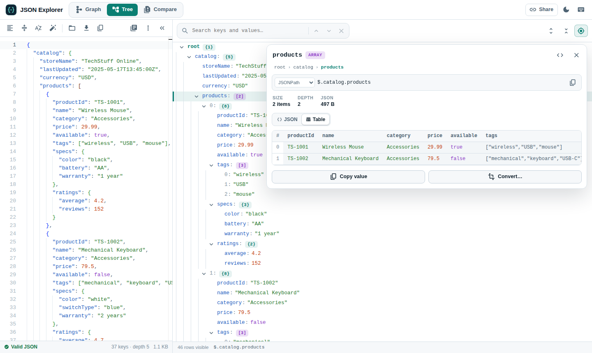
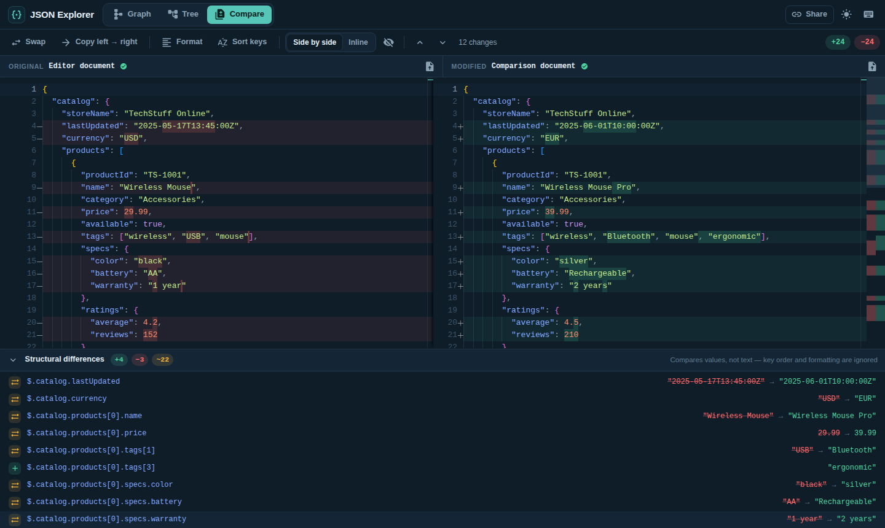

# JSON Explorer

**JSON Explorer** turns JSON into something you can see and navigate: an interactive graph, a fast tree, and a structural diff. It also validates, repairs, converts and shares JSON. Everything runs in your browser; your data is never uploaded.

🚀 **Live demo:** [https://jsonexplorer.netlify.app/](https://jsonexplorer.netlify.app/)



## Features

### Graph view
- **Readable layout.** A tidy tree that never overlaps, left-to-right or top-down, fitted to the screen.
- **Every JSON shape.** Objects, arrays, mixed and nested arrays, primitive documents, empty values and unicode.
- **Large documents stay fast.** Branches collapse automatically (breadth-first), wide arrays page in blocks of 50, and a counter shows how much is visible. Jumping to an item deep inside a huge array shows the items around it, with *Show earlier* / *Show more* on either side.
- **Collapse & expand** any node (click `+N` / `−`, double-click, or <kbd>Space</kbd>), or expand/collapse everything.
- **Search the whole document**, including collapsed parts: matches are revealed and highlighted, with <kbd>Enter</kbd>/<kbd>Shift</kbd>+<kbd>Enter</kbd> to step through them.
- **Walkthrough mode** plays through the graph node by node, with pause, step, restart and 0.5×–4× speed.
- **Minimap**, zoom controls, keyboard navigation (arrow keys), and **export** to PNG, SVG or the clipboard.

### Tree view
- Virtualized, so documents with hundreds of thousands of rows scroll smoothly.
- Previews of collapsed values (`{ id: 1, name: "Ada", … }`), indentation guides and type colors.
- Search with auto-expand, expand/collapse all, copy path or value from any row.
- Full keyboard support following the ARIA tree pattern.



### Details panel
- Click any node or row to see its **path** (JSONPath, JavaScript, jq or JSON Pointer), type, size and pretty-printed value.
- **Table view** for arrays of records, with nested objects flattened into columns (`owner.name`).
- **Smart previews** for links, ISO dates, Unix timestamps, colors and inline images.
- **Exact numbers.** Integers too large for JavaScript (e.g. 64-bit IDs) are flagged with `≈` in the views and shown exactly as written in the details panel. *Copy value* keeps every digit, and so do the structural diff and CSV/YAML conversion in browsers that support JSON source text access.
- Breadcrumbs, *Show in editor*, *Copy value* and *Convert*.

### Editor
- Monaco (the VS Code editor) with JSON validation and syntax highlighting that matches the theme.
- **Precise errors.** Messages like *"Trailing comma before '}' is not allowed"* with line and column; click to jump.
- **Repair** fixes single quotes, unquoted keys, comments, trailing commas, Python `None`/`True`, missing brackets and more.
- **Lossless** *Format*, *Minify* and *Sort keys*: number literals such as `12345678901234567890` or `1.50` are never altered, and every action can be undone.
- Open or **drag & drop** files, load from a URL, samples, download, copy, and autosave in the browser.
- **Follow cursor.** Moving the cursor in the editor highlights the matching node in the graph or tree.
- While the JSON is invalid, the views keep showing the last valid version.

### Compare
- Side-by-side or inline Monaco diff with accurate line statistics, change navigation and *hide unchanged regions*.
- **Structural differences**: a list of added, removed and changed values by path. It ignores key order and formatting and aligns arrays, so one inserted item is reported as one change. Click an entry to reveal it on both sides.
- Swap sides, copy left → right, format or sort keys on both sides, and open files into either side (or drop them).



### Convert
Generate **TypeScript interfaces**, a **JSON Schema** (draft 2020-12 with `date-time`, `email` and `uri` formats), **YAML** or **CSV** from the whole document or any selected value. Every format has a live preview and can be copied or downloaded.

### Everywhere
- Light and dark themes (following your system by default).
- **Share links**: the document is compressed into the URL, so nothing is stored on a server.
- Responsive layout for phones and tablets.
- Works offline after the first visit (PWA).
- Keyboard shortcuts for the common actions; press <kbd>?</kbd> in the app to see them.

## Keyboard shortcuts

| Shortcut | Action |
| --- | --- |
| <kbd>Alt</kbd>+<kbd>1</kbd> / <kbd>2</kbd> / <kbd>3</kbd> | Graph / Tree / Compare view |
| <kbd>Ctrl/⌘</kbd>+<kbd>O</kbd> | Open a JSON file |
| <kbd>Ctrl/⌘</kbd>+<kbd>S</kbd> | Download the JSON |
| <kbd>Ctrl/⌘</kbd>+<kbd>Shift</kbd>+<kbd>F</kbd> | Format |
| <kbd>Ctrl/⌘</kbd>+<kbd>Shift</kbd>+<kbd>M</kbd> | Minify |
| <kbd>/</kbd> | Search the graph or tree |
| <kbd>←</kbd> <kbd>→</kbd> <kbd>↑</kbd> <kbd>↓</kbd> | Move between nodes |
| <kbd>Space</kbd> | Expand or collapse the selected node |
| <kbd>F</kbd> / <kbd>+</kbd> / <kbd>−</kbd> | Fit / zoom the graph |
| <kbd>Esc</kbd> | Clear selection / close the details panel |
| <kbd>?</kbd> | Show all shortcuts |

## URL options

| Parameter | Example | Description |
| --- | --- | --- |
| `url` (or `dataUrl`) | `/?url=https://api.example.com/data.json` | Load JSON from a URL (the server must allow CORS). |
| `view` | `/?view=tree` | Start in the `graph`, `tree` or `compare` view. |
| `theme` | `/?theme=light` | Force the `light`, `dark` or `system` theme. |
| `#json=…` | *(created by **Share**)* | A compressed document embedded in the link. |

## Embedding

Embed the viewer in any page with an iframe. `?embed=1` hides the editor and header and shows a Graph/Tree switcher.

```html
<iframe id="viewer" src="https://jsonexplorer.netlify.app/?embed=1" style="width:100%;height:600px;border:0"></iframe>
<script>
  const frame = document.getElementById('viewer');
  window.addEventListener('message', (event) => {
    if (event.source === frame.contentWindow && event.data?.type === 'json-explorer:ready') {
      frame.contentWindow.postMessage({ type: 'json-explorer:set-json', payload: { hello: 'world' } }, '*');
    }
  });
</script>
```

- The viewer posts `{ type: 'json-explorer:ready' }` to the parent when it can receive data.
- Send `{ type: 'json-explorer:set-json', payload }`, where `payload` is an object, an array or a JSON string.
- Alternatively, pass `?embed=1&dataUrl=https://…` to fetch the JSON directly. `view` and `theme` also work in embed mode (the default theme is dark).
- Embedded viewers neither read nor change anything saved by the full app (document or settings).

A complete example lives in [`public/embed-demo.html`](public/embed-demo.html); open `/embed-demo.html` while the app is running.

## Getting started

Requires [Node.js](https://nodejs.org/) 18 or later.

```bash
git clone https://github.com/saiprasaad/JsonExplorer.git
cd JsonExplorer
npm install
npm start          # development server on http://localhost:3000
npm test           # unit and integration tests
npm run build      # production build + service worker in build/
```

Set `REACT_APP_GA_MEASUREMENT_ID` to enable Google Analytics (loaded lazily and only when configured).

## Project structure

```
src/
  App.js                       Theme and app providers
  theme.js                     Color palettes, MUI theme and Monaco themes
  samples.js                   Sample documents
  components/
    Workspace.jsx              Layout, document state, loading, sharing, shortcuts, embed mode
    AppHeader.jsx              Brand, view tabs and global actions
    JsonEditor.jsx             Monaco editor panel, toolbar and status bar
    JsonViewer.jsx             Graph view (React Flow)
    graph/                     Graph nodes, toolbar and walkthrough controls
    TreeView.jsx               Virtualized tree view
    DetailsPanel.jsx           Path, value, table view and actions for the selection
    JsonCompare.jsx            Diff editor and compare tools
    StructuralDiffPanel.jsx    Path-level differences
    ConvertDialog.jsx          TypeScript / JSON Schema / YAML / CSV conversion
  utils/
    json.js                    Parsing, error messages, lossless formatting, paths, stats
    graph.js                   Graph model, visibility, tidy-tree layout, search
    tree.js                    Tree flattening, expansion and search
    diff.js                    Structural JSON diff with array alignment
    convert.js                 Type inference and format converters
    share.js, storage.js, files.js
```

## Built with

[React](https://react.dev/) · [React Flow](https://reactflow.dev/) · [Monaco Editor](https://microsoft.github.io/monaco-editor/) · [MUI](https://mui.com/) · [jsonc-parser](https://github.com/microsoft/node-jsonc-parser) · [jsonrepair](https://github.com/josdejong/jsonrepair) · [lz-string](https://github.com/pieroxy/lz-string) · [html-to-image](https://github.com/bubkoo/html-to-image)
